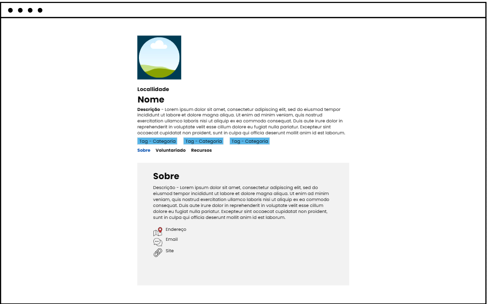
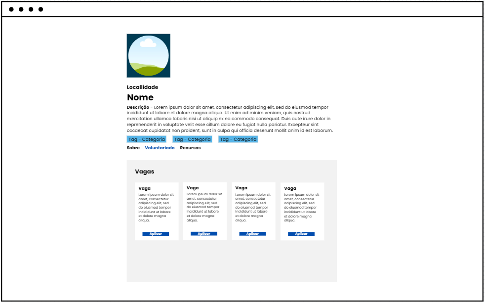

# Projeto de Interface

No projeto de interface do sistema, estamos dando prioridade a aspectos como velocidade, facilidade de acesso e facilidade de uso, portanto o projeto apresenta uma aparência visual consistente em todas as telas.

## Diagrama de Fluxo

O diagrama apresenta o estudo do fluxo de interação do usuário com o sistema interativo e  muitas vezes sem a necessidade do desenho do design das telas da interface. Isso permite que o design das interações seja bem planejado e gere impacto na qualidade no design do wireframe interativo que será desenvolvido logo em seguida.

O diagrama de fluxo pode ser desenvolvido com “boxes” que possuem internamente a indicação dos principais elementos de interface - tais como menus e acessos - e funcionalidades, tais como editar, pesquisar, filtrar, configurar - e a conexão entre esses boxes a partir do processo de interação. Você pode ver mais explicações e exemplos https://www.lucidchart.com/blog/how-to-make-a-user-flow-diagram.

As referências abaixo irão auxiliá-lo na geração do artefato “Diagramas de Fluxo”.

> **Links Úteis**:
> - [Fluxograma online: seis sites para fazer gráfico sem instalar nada | Produtividade | TechTudo](https://www.techtudo.com.br/listas/2019/03/fluxograma-online-seis-sites-para-fazer-grafico-sem-instalar-nada.ghtml)

## Wireframes

Conforme o diagrama de fluxo do projeto, apresentado no item anterior, as telas do sistema são apresentadas em detalhes nos itens que se seguem.

### Homepage logado (ONG)
Requisitos associados: RF-01, RF-04, RF-05, RF-07, RF-08, RF-10, RF-11

### Menu Homepage logado (ONG)
Requisitos associados: RF-01, RF-04, RF-05, RF-07, RF-08, RF-10, RF-11

### Homepage logado (ADM)
Requisitos associados: RF-01, RF-04, RF-05, RF-07, RF-08, RF-09, RF-10, RF-11

### Menu Homepage logado (ADM)
Requisitos associados: RF-01, RF-04, RF-05, RF-07, RF-08, RF-09, RF-10, RF-11

### Homepage não logado 
Requisitos associados: RF-01, RF-05, RF-12

### Menu Homepage não logado 
Requisitos associados: RF-01, RF-05, RF-12

### Perfil ONG - Sobre
Requisitos associados: RF-01, RF-04, RF-06, RF-10

### Perfil ONG - Vagas
Requisitos associados: RF-01, RF-04, RF-06, RF-10

### Perfil ONG - Recursos
Requisitos associados: RF-01, RF-04, RF-06, RF-10

### Tela - Como deseja entrar?
Apresenta as opções de redirecinamento para telas de "Login" e/ou "Cadastro". Requisitos associados: RF-01

Figura 4 - Tela "Como deseja entrar?"

### Tela - Cadastro

Apresenta os campos a serem preenchidos com os dados do usuário para realização do cadastro na plataforma. Requisitos associados: RF-01

Figura 5 - Tela de Cadastro #1

Figura 6 - Tela de Cadastro #2

### Tela - Autenticação de conta

Apresenta a solicitação de autenticação da conta nova do usuário. Requisitos associados: RF-02

Figura 7 - Tela de Autenticação de conta

### Tela - Login

Apresenta os dados solicitados para acesso á conta do usuário (e-mail cadastrado e senha). Requisitos associados: RF-01

Figura 8 - Tela de Login

### Tela - Esqueceu a senha?

Apresenta campo solicitando o e-mail cadastrado para envio de código de redefinição de senha. Requisitos associados: RF-03

Figura 9 - Tela "Esqueceu a senha?"

### Tela - Redefinição de senha

Apresenta campos para redefinição de senha do usuário. Requisitos associados: RF-03

Figura 10 - Tela de Redefinição de senha

### Tela - Gerenciamento de cadastros de ONGs (ADMIN)

Apresenta campos com cadastros pendentes para aprovação ou negação. Requisitos associados: RF-09

Figura 11 - Tela de Gerenciamento de cadastros

